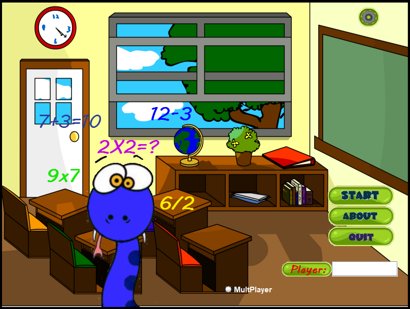
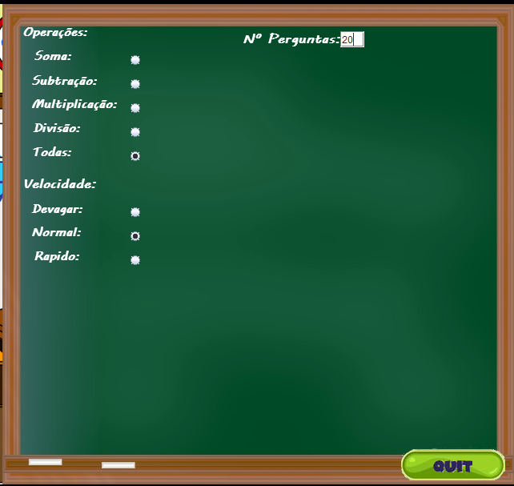
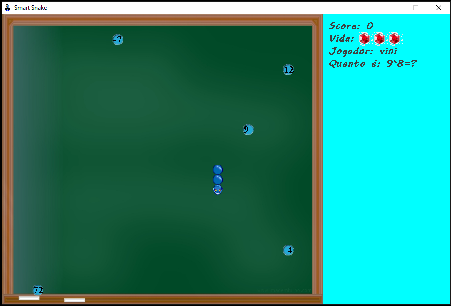

# This is a prototype of a multiplayer serious game.

## Requirements

This prototype requires Java 7 onward, and the framework Xstream version 1.4.8 to persist the xml files.

## Introduction

<b>MathSnake</b> is a prototype of a serious game created to help child learn the basic math operations by play a snake game.

The multiplayer work on the same machine, one player will play the game with the arrows and the other with the "W", "S", "A", D" letters.

## MathSnake

* The user can configure the level speed of the snake, and also the operator.

* Mission: the user has to eat the ball with the right answer of the question.

* Multplayer is available.

